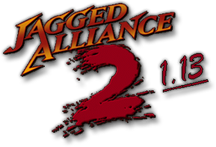

# JA2 v1.13

 
 
 

  

 
 

### Preamble

Jagged Alliance 2 v1.13 is a modification for the Jagged Alliance 2 game.

Original development was done through SVN, this however ended abruptly in 2022, to keep the development going the step to Github has been made.

Feel free to participate in the development!
  
  
For more information you can visit the following locations:
- [The Bear's Pit Forum](https://thepit.ja-galaxy-forum.com) 
- [Jagged Alliance 2 v1.13 - Starter Documentation](https://github.com/1dot13/documentation)
- [How to get: latest 1.13, 7609, feature-descriptions and more](http://thepit.ja-galaxy-forum.com/index.php?t=msg&th=24648&start=0&)
- [JA2 v1.13 pbworks wiki (outdated)](http://ja2v113.pbworks.com/w/page/4218339/FrontPage)
- [The Bear's Pit Discord](https://discord.gg/GqrVZUM)

In case of any issues, look at [Reports](#Reports) or [Participation](#Participation)  

### Downloads

> **Note**
> All-in-one releases come for different languages and include
> JA2 v1.13, the Map Editor and JA2 Unfinished Business.

Visit the [releases page](https://github.com/1dot13/source/releases) to download the latest all-in-one.

### Installation

1. Install the original Jagged Alliance 2
2. Download the latest all-in-one release and copy its content to JA2 game directory. Overwrite when asked.
3. Modify ini settings if you like.
4. Play the game.

   Some additional information on can be found in folder "docs" inside download.  
     
   If you face issues with higher resolutions, alt+tab not working, blackscreen, etc.,  
   run the "cnc-ddraw-config.exe" in game-folder and adjust settings to your liking.  
   (those issues can occur due to the combination of old game and modern OS/hardware, cnc-ddraw helps to avoid those) 

### Visual Studio setup

1. Run `Visual Studio 2019` or newer.
2. Clone and open the location with the source code using one of these two options:
    * Click `Clone a repository`
        * Enter `git@github.com:1dot13/source.git` or `https://github.com/1dot13/source.git` in the Repository location field, select the path you want to clone the repository to and click `Clone`.
        * Double-click on `Folder View` in the `Solution Explorer`
    * Click `Open a local folder`
        * Use this option if you already cloned the repository yourself.
3. Visual Studio will automatically detect the CMake configuration files and will run the CMake generation. There will bet a CMake error in the logs saying `No existing preset was found, copied a preset template to [some_path]`. This is normal and only happens once.
4. Click on the dropdown that says `x64-Debug` and select `Manage configurations...`. This should trigger Visual Studio to load the `CMakeUserPresets.json` file it just copied. Now you can close the window for managing the configurations.
5. The `x64-Debug` option should have been replaced by `1dot13 Debug`. Click it and select `Manage configurations...` again. Here is where you configure the language for the built executables as well as which ones to build, Most important, here is where you set `CMAKE_RUNTIME_OUTPUT_DIRECTORY` to the path to your JA2 1.13 installation. This will be used for debugging. Note that the path needs to have a working 1.13 installation, and that includes the 1.13 game data.
6. You can use `Build -> Build All` to build the executables you selected in the configuration.

### Reports

For more information and reports, visit [Bug reports at Bear's Pit Forum](http://thepit.ja-galaxy-forum.com/index.php?t=thread&frm_id=216&) or join the [Bear's Pit Discord](https://discord.gg/GqrVZUM "Bear's Pit Discord")

### Participation 

Feel free to participate on GitHub. If you want to know how, or simply wanna share your thoughts on a topic join the [Bear's Pit Discord](https://discord.gg/GqrVZUM "Bear's Pit Discord")

